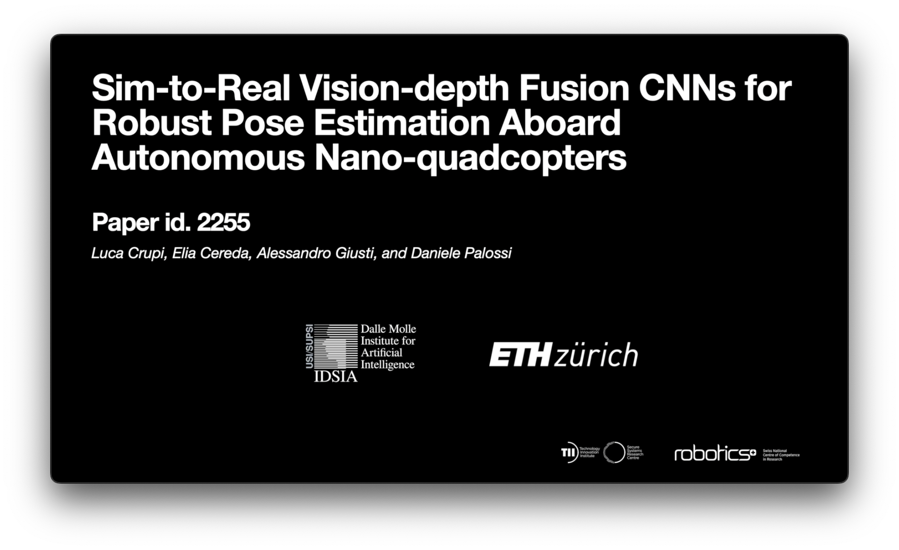

## IROS'23 — Supplementary video material

Sim-to-Real Vision-depth Fusion CNNs for Robust Pose Estimation Aboard Autonomous Nano-quadcopters

### Authors
Luca Crupi1,
Elia Cereda1,
Alessandro Giusti1,
Daniele Palossi1,2

1 Dalle Molle Institute for Artificial Intelligence (IDSIA), USI and SUPSI, Lugano, Switzerland. 
2 Integrated Systems Laboratory (IIS), ETH Zürich, Zürich, Switzerland. 

<!--
<a href="https://youtu.be/xxxxx">
  <b>In-field experiments video</b>
   
    
</a>
-->
